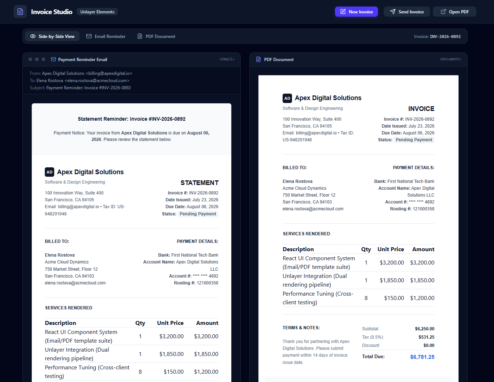
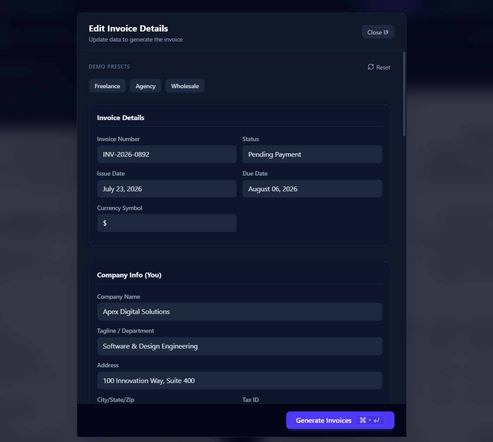

# Invoice Studio

A dual-mode invoice and payment reminder generator built with React and [Unlayer Elements](https://github.com/unlayer/elements). One component tree renders both an HTML payment reminder email and a print-ready PDF invoice.

Built for the **Build with Elements Challenge**.

## Why we built this

Most invoicing tools maintain two separate templates: an HTML email for reminders and receipts, and a separate PDF or print layout for the official document. Keeping both synced when the design or the invoice math changes is tedious and easy to break.

Invoice Studio solves this with Unlayer Elements. The invoice layout is defined once in `src/components/InvoiceContent.jsx` using Elements primitives (`Row`, `Column`, `Table`, `Heading`, `Paragraph`, `Divider`). That same tree renders two ways:

- Wrapped in `<Email>` → email-safe HTML for the payment reminder
- Wrapped in `<Document>` → print-ready HTML for the PDF invoice

## Screenshots




## Features

- **Single data source, two live outputs**: edit the invoice in one form and both the email and document previews update instantly — no separate templates to keep in sync.
- **Full invoice editor**: a modal form to set company info, client info, invoice details, line items (add/remove), tax rate, discount, notes, and payment/bank details, with totals recalculated live. `Ctrl + Enter` closes the editor, `Esc` cancels.
- **Form validation**: required fields (client name, client email, at least one valid line item) are checked before Send or Download are enabled, with an inline "Missing required fields" indicator.
- **Preset sample data**: one-click Freelance, Agency, or Wholesale demo invoices, or reset back to the original sample data.
- **Three preview modes**: side-by-side, email-only, or document-only, so you can inspect either output in isolation.
- **Send Invoice**: opens the user's default mail client via `mailto:`, prefilled with the client's email, subject line, and an invoice summary (invoice number, due date, total due).
- **Download PDF**: renders the document view to a high-resolution PNG (`html-to-image`) and embeds it into a matching-size PDF (`jsPDF`), opened in a new tab — with a loading indicator while it generates.
- **Pay button interception**: the "Pay Invoice Online" button in the preview uses a placeholder checkout URL and is intercepted in-app with a notification, demonstrating where a real payment gateway would go without wiring one up.
- **Strict styling boundary**: all content inside `<Email>`/`<Document>` uses Elements' own style props (`backgroundColor`, `fontSize`, `padding`, etc.) so the output survives real email clients and print engines. Tailwind CSS v4 is used only for the app shell — forms, toolbar, buttons — never inside the invoice content itself.

## Project Structure

```text
invoice-elements/
├── index.html
├── package.json
├── vite.config.js
└── src/
    ├── main.jsx
    ├── index.css                # Tailwind imports + print styles
    ├── App.jsx                  # App shell, view switcher, modal, PDF export, send logic
    ├── components/
    │   ├── InvoiceContent.jsx   # Shared Elements component tree
    │   ├── EmailWrapper.jsx     # Wraps InvoiceContent in <Email>
    │   ├── DocumentWrapper.jsx  # Wraps InvoiceContent in <Document>
    │   └── InvoiceForm.jsx      # Invoice editor form (used inside the modal)
    └── data/
        └── invoiceData.js       # Default invoice data + total calculations
```

## Getting Started

### Prerequisites

Node.js 18+ (20+ recommended).

### Running locally

1. Clone the repository and install dependencies:

```bash
   git clone https://github.com/aditya-2k23/invoice-elements.git
   cd invoice-elements
   npm install
```

2. Start the development server:

```bash
   npm run dev
```

3. Open `http://localhost:5173` in your browser.

### Available Scripts

- `npm run dev` — starts the local development server
- `npm run build` — builds the app for production
- `npm run preview` — previews the production build locally

## Tech Stack

- **Framework**: React 19, Vite
- **UI Primitives**: `@unlayer/react-elements`
- **Styling**: Tailwind CSS v4
- **PDF Generation**: `html-to-image`, `jsPDF`
- **Icons**: Lucide React

## Known Limitations

No backend or database — all invoice data lives in browser state and resets on reload. "Send Invoice" opens your own mail client rather than sending server-side, and PDF export is image-based (not vector text) since it's built on the browser's rendered output rather than a PDF text-layer library.

## License

This project is licensed under the MIT License. See `/LICENSE` for details.
